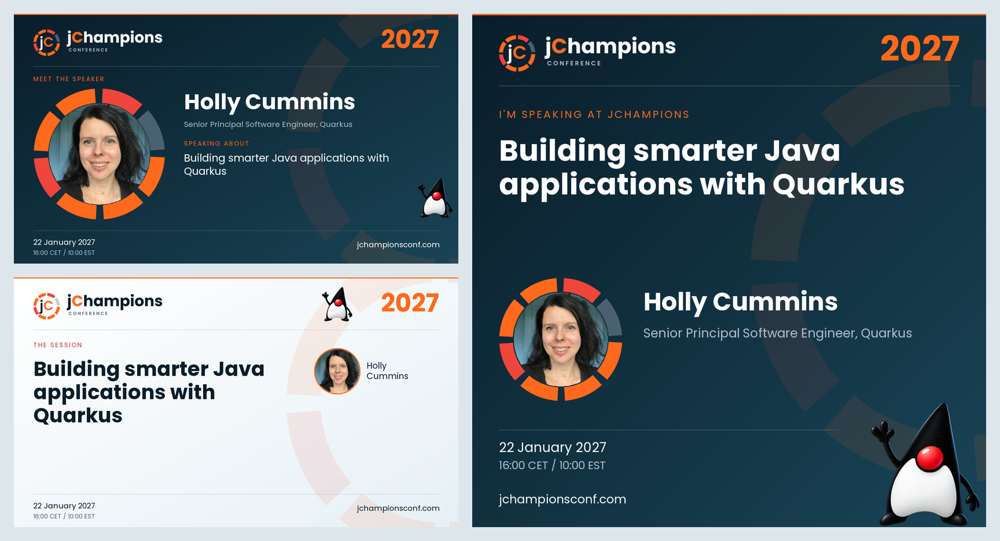

# jChampions speaker cards

A Java application that generates speaker cards, talk banners, and social images for the jChampions Conference. It automates the repetitive work of updating names, photos, session details, and schedules across conference graphics.

## What it does

- Imports speakers and talks from a Sessionize Excel schedule export and downloads speaker photos.
- Stores speaker and session data in PostgreSQL.
- Renders HTML templates as PNG images, individually or in a batch.
- Provides a local speaker directory with links to the generated cards.

Built with Quarkus, Renarde, Qute templates, Hibernate ORM with Panache, and Apache POI.

## Background

The motivation and implementation are described in [Automating Conference Assets with Java: The Quarkus System Behind jChampions 2026](https://www.the-main-thread.com/p/quarkus-jchampions-speaker-card-generator-tutorial) on The Main Thread.

## Run locally

Use IBM Semeru Java 27 and a running Docker or Podman environment for the development PostgreSQL database. Select the project's SDKMAN Java version and start the application:

```sh
sdk env
./mvnw quarkus:dev
```

Place `SelectedWithSchedule.xlsx` in the project root, then import it and generate all cards:

```sh
curl "http://localhost:8080/api/import/csv/SelectedWithSchedule.xlsx"
curl "http://localhost:8080/api/banners/generate-all?outputDir=./speaker-banners"
```

Browse the [local speaker directory](http://localhost:8080/). Generated PNGs are saved under `speaker-banners/` in the `speaker/`, `talks/`, and `social/` folders. The current configuration recreates the database schema on startup.

Run `./mvnw verify` to build the application and test Excel import, PostgreSQL persistence, and PNG rendering. Docker or Podman must be running for the test database.

## 2027 artwork

The 2027 cards follow the new community supporter artwork: Poppins, teal and white backgrounds, orange/red segmented rings, and the waving Duke. Speaker and talk cards are 1280 × 720; social cards are 1080 × 1080.



These previews use existing speaker photography with an illustrative talk and date. Actual session dates and times come from the imported schedule. Set the edition label with `conference.year` in `src/main/resources/application.properties`.

Card templates live in `src/main/resources/templates/Banner/`, including shared styles and a shared schedule footer. The original supporter SVGs are in `docs/artwork/2027/`. Derived SVG/PNG assets are in `src/main/resources/META-INF/resources/static/images/2027/`; bundled Poppins fonts and their license are in `static/fonts/` alongside them.

`python3 scripts/prepare-2027-artwork.py` regenerates the derived SVGs from the originals. After changing the artwork, export each derived SVG to its adjacent PNG at its declared dimensions; the PNG renderer uses those raster exports.

### Art direction


